# SQL-Alchemy: Surfs Up!

I am so excited to be planning a long holiday vacation to Honolulu in Hawaii! In order to determine the perfect time of year to visit Hawaii, I am going to analyze the climate data over the last year. I will use a SQLAlchemy ORM Requests, Pandas and Matplotlib to complete my analysis.

## Table of contents
* [Climate Analysis](#climate_analysis)
* [Precipitation Analysis](#precipitation_analysis)
* [Station Analysis](#station_analysis)
* [Climate App](#climate_app)
* [Conclusion](#conclusion)
* [Resources](#resources)
* [Contact](#contact)

## Climate Analysis

I imported the dependencies I will need to complete my analysis into a `Jupyter Notebook` . 
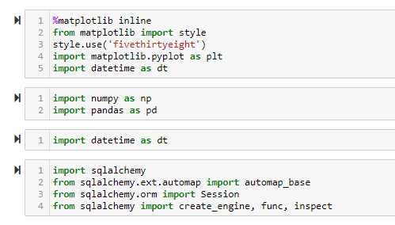

Then I used `create_engine` to connect to my `sqlite` database. Once connected, I used `automap_base` to find my `leys` which were “Measurement” and “Station”. 

I then saved them as classes by using the below code: 

`Measurement = Base.classes.measurement`  &  `Station = Base.classes.station` 

I used `Session(engine)`  to complete my queries. 

## Precipitation Analysis

To query the precipitation data for the past 1 year, I used the below session query code: 

` query_date = dt.date(2017, 8, 23) - dt.timedelta(days=365) ` 

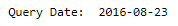

`session.query(Measurement.date, func.avg(Measurement.prcp)).\ `
   ` filter(Measurement.date > query_date).group_by(Measurement.date).order_by(Measurement.date).all()` 

Once I retrieved by results, I turned the data into a Dataframe using `pandas`  ` pd.DataFrame` . I then sorted the the dataframe by date. 

 ` results_df = pd.DataFrame(results, columns=['Date', 'Precipitation']) `
 `  results_df.set_index('Date', inplace=True) `

I then showed the precipitation data in a Line Graph by using ` .plot( ) ` function. 

I performed summary statistics on the date by using the `pandas`  ` .describe( ) ` function. 

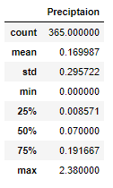

## Station Analysis

To find the total number of stations, I used the below query. The total number of stations is 9
` station_count = session.query(func.count(Station.station)).all( ) `

Then I used the below query to find out the totally number of observatiosn per station and sorted them descending. This shows that the most active station is “USC005192181” 

` station_freq = session.query(Measurement.station, func.count(Measurement.station)).\
    group_by(Measurement.station).order_by(func.count(Measurement.date).desc( )).all( ) `

For the most active station, I calculated the lowest, highest and average temperature. I used `func.min` `func.max` and `func.avg` in my query. I set a filter to only show the data for station "USC00519281" .

` station_sum = session.query(func.min(Measurement.tobs), func.max(Measurement.tobs),   
func.avg(Measurement.tobs)).filter(Measurement.station == "USC00519281").all( ) `

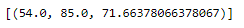

For the most active station, I created a histogram to show the temperature observations over the last 12 months. I use dhte below qury and code to find the date and plot the graph:

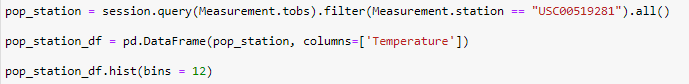

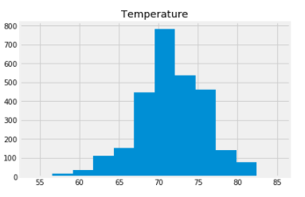

## Climate App

I used `FLASK` to create a Weather App website that would display my data queries and interact with the user to return data searches. 
To set up my app I use the below code in Visual Studio Basic

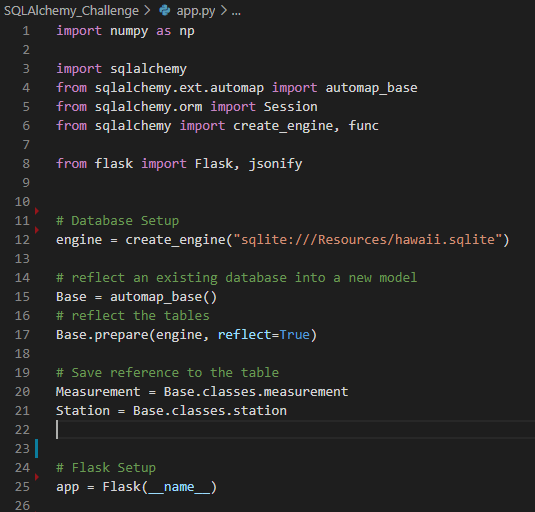

I then created my routes: 

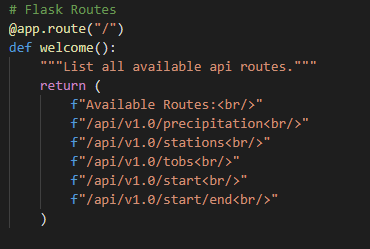

When running my app in terminal, I get the below results on the internet. This shows my main page and the routes available. 

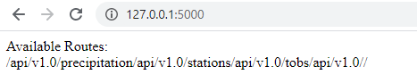

For my precipitation route, I used the below code and turned my query results into a list so I could return a `JSON` list.

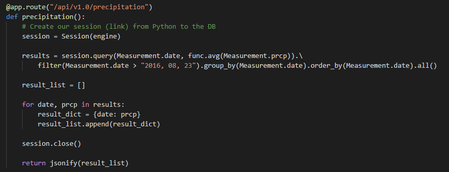

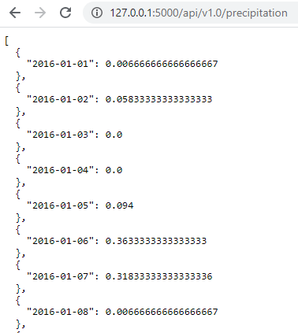

For a list of stations, I used the below query and used `station_list = list(np.ravel(stations)) ` to make my results into a list to show `JSON` 

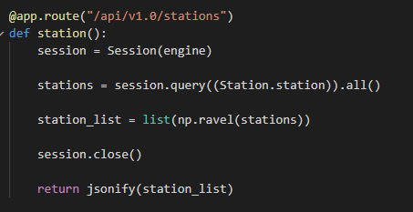

For my temperature observation query, I used the below code and again turned my results into a list using a For loop to return a `JSON` list. 

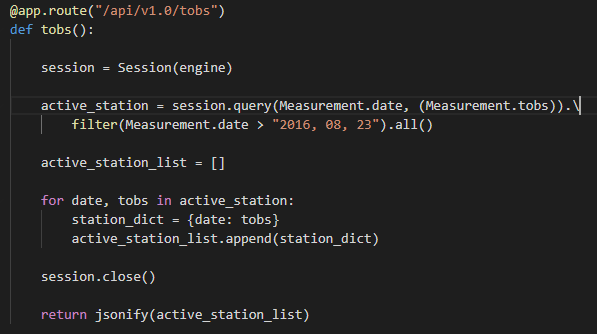

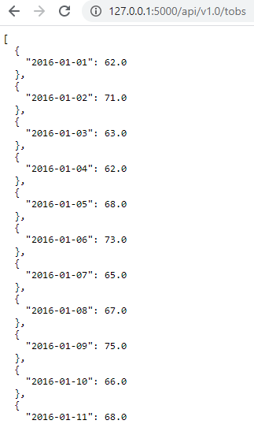

I then created a query that returns the minimum temperature, the average temperature, and the max temperature for a given start or start-end range. This search is interactive, and you have to enter the date in the URL line. The results are returned as a `JSON` dictionary. 

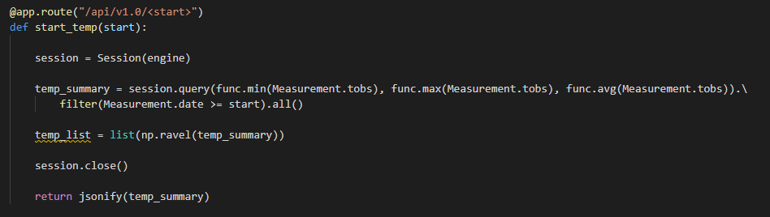

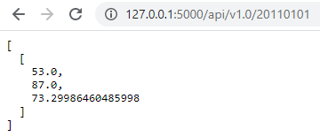

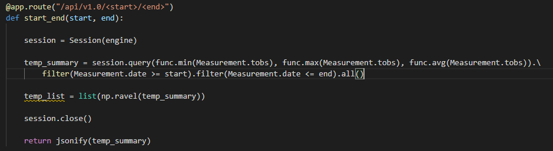

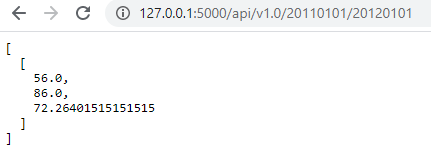

## Conclusion

## Resources 

Link to [Jupyter Notebook]( https://github.com/Ssimoes48/SQLAlchemy_Challenge/blob/main/sara_climate.ipynb) 

Link to [app.py]( https://github.com/Ssimoes48/SQLAlchemy_Challenge/blob/main/app.py)

## Contact

[Sara Simoes](https://ssimoes48.github.io/)
