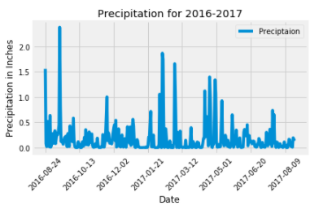
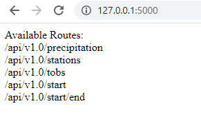

# SQL-Alchemy: Surfs Up!

> Here goes your awesome project description!

## Table of contents
* [General info](#general-info)
* [Climate Analysis](#climate_analysis)
* [Precipitation Analysis](#precipitation_analysis)
* [Station Analysis](#station_analysis)
* [Climate App](#climate_app)
* [Conclusion](#conclusion)
* [Resources](#resources)
* [Contact](#contact)

## General info

## Climate Analysis

## Precipitation Analysis

## Station Analysis

## Climate App

## Conclusion

## Resources 

Link to [Jupyter Notebook]( https://github.com/Ssimoes48/SQLAlchemy_Challenge/blob/main/sara_climate.ipynb) 

Link to [app.py]( https://github.com/Ssimoes48/SQLAlchemy_Challenge/blob/main/app.py)

## Contact

[Sara Simoes](SSimoes48.github.io)
